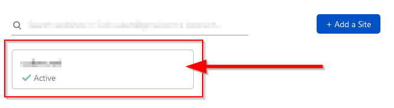
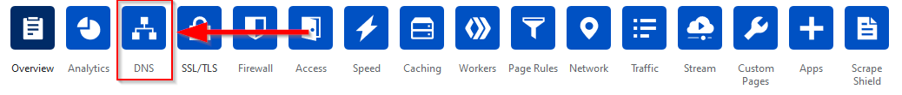
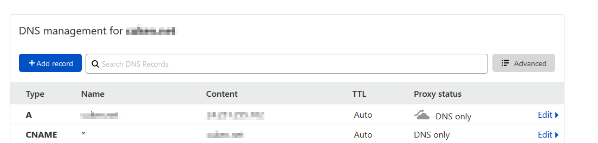
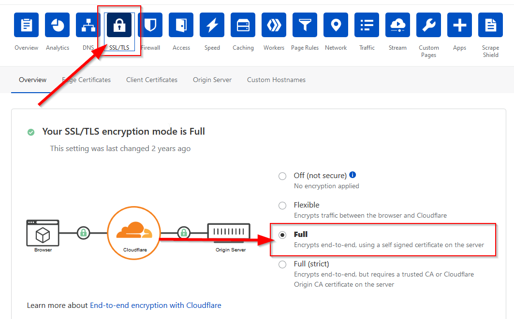
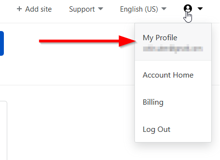
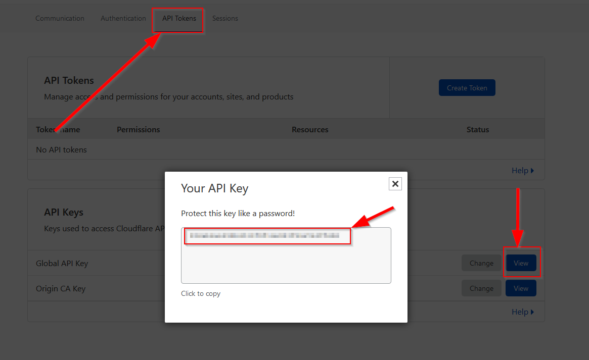

# Mining Node Setup Guide

This guide assumes you are running Ubuntu or a similar flavor of Linux.

Before you begin, make sure you have an active account on whatever Volition network you plan to join and have the genesis block for that network. When you start mining, you will need someone to upgrade your regular account to a mining account.

## Stack Description

Currently the docker-compose stack consists of:

- Socket-Proxy (secure docker.sock to internal requests only)
- Traefik2 (as reverse proxy)
- Dozzle (Container logs vieweable over https)
- Glances (HTop over https)
- Watchtower (automatically update docker containers)
- Volition (volition node miner)

## Prepare Your Server

```
sudo apt update
sudo apt install curl docker docker-compose git openssl vim
```

Also, [set up an SSH key](https://docs.github.com/en/github/authenticating-to-github/generating-a-new-ssh-key-and-adding-it-to-the-ssh-agent) for use with github.

You may need to create an \~/.ssh/config file:

```
Host *
  AddKeysToAgent yes
  IdentityFile ~/.ssh/<ssh_key_filename>
```

You may also want to configure git to automatically pull submodules:

```
git config --global submodule.recurse true
```

Finally, make sure your server's port 80 is open. Open port 443 as well if you have a domain name and plan to configure HTTPS/SSL.

## Clone and Build the Node

```
git clone --recurse-submodules git@github.com:cryptogogue/vol-node-cpp.git
```

Build the docker image using a helper script:

```
cd vol-node-cpp
./ops/build.sh
```

This will take a long time. You may see some red warning messages; they are not an immediate cause for concern.

Once the build is done, you should see a message indicating that image was successfully tagged.

You can get a list of the Docker images available on your system by typing:

```
docker image ls
```

If you look inside build.sh, you'll see it generates a header file containing some information from git, then it invokes docker to build the image.

## Configuring HTTPS/SSL

To use HTTPS/SSL you will need a domain name. You will need to update the CNAME and A records in your domain's DNS to point at the public IP address of the server running your node. Procuring a domain name is outside of the scope of this document.

We will use [traefik](https://traefik.io) as a reverse proxy to route requests into your volition mining node. Traefik will create subdomains per our docker containers and use LetsEncrypt to issue our SSL certificates. To validate domain owenrship, we'll use LetsEcnrypts CloudFlare DNS challenge.

### CloudFlare Setup

First, if you do not already have a [CloudFlare](https://www.cloudflare.com/) account, create one and log in.

Once logged in; add your domain to CloudFlare for DNS management.
Cloudflare will instruct you to change your domain name servers, follow the instructions provided by CloudFlare.

Once the domain has been added to CloudFlare, we need to change some settings.
Click on the domain name to open its settings.



Click on the DNS options button.



Make the following changes:

* Verify the A record IP is set correctly
* Change the root domain records Proxy status to DNS only
* Add a new CNAME record
  * Name: *
  * Target: your domain name
  * TTL: Auto
  * Proxy status: DNS Only
* Make sure your domain host is using the Cloudflare nameservers shown below
  
Your settings should look similiar to this:



Once done, click on the SSL/TLS button at the top. Make sure you have SSL/TLS encryption mode set to full.



> **If your server does not have a static IP, follow the next step**

To update CloudFlare with our public IP, we'll need our CloudFlare Global API key.

Click on your account icon on the top right of the screen and click My Profile.



Click on API Tokens -> Global Api Key -> View, and copy the Global API Key, we'll use it later to set up our DDNS service.



## Docker Setup

We'll create two networks to serve both our reverse proxy network, and our secure docker.sock network. 

Run the following commands:

$ `docker network create --gateway 192.168.90.1 --subnet 192.168.90.0/24 t2_proxy`

$ `docker network create --gateway 192.168.91.1 --subnet 192.168.91.0/24 socket_proxy`

Find a spot on your server where you'd like the docker container data to persist. In the below examples that path is `/mnt/data/docker` but you can use whatever you want.

### Create your docker data directory

Create the required folders for the docker volition stack.

$ `mkdir -p /mnt/data/docker/{traefik2/{acme,rules},volition}`

Create and set permissions for the acme.json file which will store the certificate information.

$ `touch /mnt/data/docker/traefik2/acme/acme.json`

$ `chmod 600 /mnt/data/docker/traefik2/acme/acme.json`

Copy the rule files into the traefik2/rules directory.

$ `cp [location of vol-cpp clone]/ops/traefik2/rules/* /mnt/data/docker/traefik2/rules/` 

Edit middlewares.toml and replace `[YOURDOMAINHERE]` with your root domain.
(example: `customFrameOptionsValue = "allow-from https:[YOURDOMAINHERE]"`
 -> `customFrameOptionsValue = "allow-from https:cuken.net"`) (Do not include http(s))

Copy the enviornment file into the docker data directory

$ `cp [location of vol-cpp clone]/ops/.env.example /mnt/data/docker/.env`

Edit the .env file with your information.

Copy the docker-compose.yml into the docker data directory

$ `cp [location of vol-cpp clone]/ops/docker-compose.yml /mnt/data/docker/docker-compose.yml`

### Set Up the Volition Docker Directory

The example docker-compose files map `$DOCKERDIR/volition` onto /var/lib/volition/ inside the Docker container. This folder should be configured to contain the genesis block, the volition.ini file and the mining keys.

Copy and rename the example volition.ini:

$ `cp [location of vol-cpp clone]/ops/volume-volition/volition.ini.example mnt/data/docker/volition/volition.ini`

Edit volition.ini by adding the name of the account you plan to use for mining:

```
control-key                 = /var/lib/volition/keys/control.pub.pem
control-level               = config
genesis                     = /var/lib/volition/genesis.json
keyfile                     = /var/lib/volition/keys/mining.priv.pem
openSSL.client.caConfig     = /etc/ssl/certs
persist                     = /var/lib/volition/persist-chain
port                        = 9090

miner                       = <your miner account name>
```

Generate the mining keys with the helper script:

$ `[location of vol-cpp clone]/ops/make-keys.sh`

The keys will be placed ./ops/volume-volition/keys. After running the script, you should have two sets of .pem files: one for mining and one for mining node control.

Move the keys into your volition docker directory.

$ `cp [location of vol-cpp clone]/ops/volume-volition/keys /mnt/data/docker/volition/keys`

Finally, use curl to fetch the genesis block:

```
curl <URL of genesis block> -o /mnt/data/docker/volition/genesis.json
```

## Upgrade Your Account

Once your node is connected to the network, you are ready to upgrade your account and start mining.

At the time of this writing, self-serve mining accounts aren't supported. Those will entail obtaining a verified digital identity from a third party.

To upgrade your account, ask someone with an administrator account to help you. You will need to send them the URL of your mining node.

If you don't need to send miner control commands, you are done and can take a break.

## Starting the Node

Docker-compose will manage the container state, and rebuild the images as needed.

```
cd /mnt/data/docker
docker-compose up -d
```

## Updating the Node

From time to time you will want to update to the latest mining node software. To do so, SSH in to your server, pull the latest, rebuild and restart:

```
cd vol-node-cpp
git pull
./ops/build.sh
cd /mnt/data/docker
docker-compose up -d
```
> When the volition mining node is put on docker-hub, the stack will update it automatically